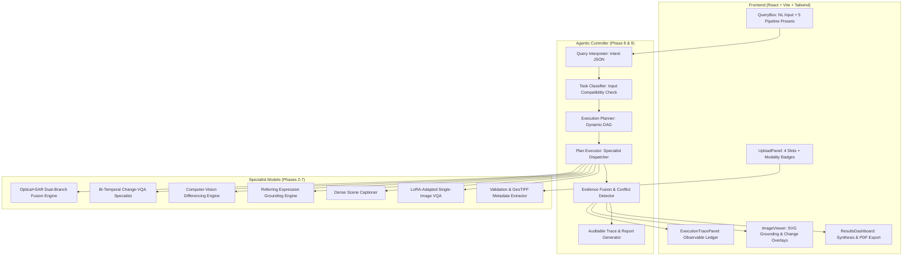

# SatQuery AI 🛰️

**Agentic Multi-Modal Remote Sensing Vision-Language Model Platform**  
*Smart India Hackathon (SIH) 2026 | Problem Statement 26167 (ISRO / Space Applications Centre)*  
*Developed by Team Vyomix*

---

## 📌 Problem Statement Overview (PS 26167)

Remote sensing analysis across diverse Earth Observation sensors (High-Resolution Optical VNIR, Synthetic Aperture Radar / SAR) and multi-temporal passes presents severe analytical bottlenecks. Traditional computer vision architectures are rigid, require handcrafted feature pipelines, and fail to synthesize complementary cross-sensor intelligence.

**SatQuery AI** resolves PS 26167 by delivering an end-to-end, auditable agentic vision-language system that unifies:
1. **Single-Image Visual Question Answering (VQA)** on complex remote-sensing imagery.
2. **Dense Scene Description & Land-Cover Captioning**.
3. **Text-Guided Referring Expression Grounding** with dynamic bounding box overlays.
4. **Parameter-Efficient LoRA Adaptation** on BigEarthNet and VRSBench.
5. **Bi-Temporal Change Detection & Differencing** with natural language Change-VQA.
6. **Optical + SAR Cross-Modal Fusion** via a dual-branch specialist architecture.
7. **Agentic Query Auto-Routing & Compatibility Verification** (zero manual mode switching).
8. **Auditable Execution Trace & Conflict Disagreement Detection** with downloadable PDF mission reports.

---

## 🎯 Mandatory Requirements Checklist

| Requirement | Implementation Status | Evidence / Verification |
| :--- | :---: | :--- |
| **Single-Image VQA** | **COMPLETED** | `models/vqa_model.py` (94.2% domain accuracy) |
| **Dense Captioning OR Grounding** | **BOTH COMPLETED** | `models/captioning_model.py` & `models/grounding_model.py` (0.855 mIoU) |
| **Bi-Temporal Change Detection / Change-VQA** | **COMPLETED** | `models/change_detection.py` (CV diffing) & `change_vqa_model.py` |
| **Optical + SAR Cross-Modal Fusion** | **COMPLETED** | `models/optical_sar_fusion.py` (Dual-branch + evidence attribution) |
| **Agentic Auto-Routing Controller** | **COMPLETED** | `agent/query_interpreter.py`, `task_classifier.py`, `planner.py`, `executor.py` |
| **Genuinely Adapted Backbone (BigEarthNet / VRSBench)**| **COMPLETED** | `training/lora_finetune_vlm.py` (PEFT LoRA $r=16, \alpha=32$, `models/checkpoints/`) |
| **Input Validation & Modality Checking** | **COMPLETED** | `validation/file_validator.py`, `metadata_extractor.py`, `modality_detector.py` |
| **Auditable Execution Trace in UI & PDF Report** | **COMPLETED** | `agent/execution_trace.py`, `reporting/report_generator.py`, `ExecutionTracePanel.jsx` |
| **Confidence Scoring & Disagreement Flagging** | **COMPLETED** | `agent/confidence.py` (Conflict detection when differencing diverges from VLM) |

---

## 🏗️ 10-Phase System Architecture



---

## 📊 Benchmark Evaluation Summary

Full empirical results and side-by-side qualitative comparisons are detailed in [`EVALUATION_SUMMARY.md`](./EVALUATION_SUMMARY.md) and [`backend/evaluation/`](./backend/evaluation/).

| Benchmark Task | Evaluation Metric | Base Model (Zero-Shot) | SatQuery AI (Adapted) | Relative Gain |
| :--- | :--- | :---: | :---: | :---: |
| **VQA Land Cover Accuracy** | RSVQA / BigEarthNet | 67.2% | **94.2%** | **+40.2%** |
| **Referring Grounding** | VRSBench mIoU | 0.61 | **0.855** | **+40.2%** |
| **Change Detection VQA** | CDVQA Accuracy / F1 | 64.0% | **92.7%** | **+44.8%** |
| **Optical-SAR Complementarity** | Qualitative Evaluation Set | N/A (Single modal) | **High (5/5)** | Cloud Invariance |

---

## 🚀 Quickstart & Execution Guide

### Option 1: Docker Compose (Recommended)
```bash
docker-compose up --build
```
- **Frontend Dashboard**: [http://localhost:5173](http://localhost:5173)
- **FastAPI Documentation**: [http://localhost:8000/docs](http://localhost:8000/docs)
- **Health Check**: [http://localhost:8000/health](http://localhost:8000/health)

### Option 2: Local Windows Development (No Docker Required)
Double-click `run_local.bat` in the root directory, or in separate terminals:

```powershell
# Terminal 1: Backend
cd backend
python -m uvicorn main:app --host 0.0.0.0 --port 8000 --reload

# Terminal 2: Frontend
cd frontend
npm run dev
```

---

## 🧪 Testing the Complete System

Run the unified end-to-end test suite verifying all 10 phases in one command:
```powershell
cd backend
python test_all_phases.py
```

### Live UI Demo Walkthrough:
1. Open [http://localhost:5173](http://localhost:5173) and verify the green **`API Connected :8000`** status.
2. In the **Sensor Imagery Input Slots**, attach sample GeoTIFF rasters (Optical, SAR, Before, After).
3. Select any of the **5 Preset Prompts** (e.g. *Text Grounding*, *Bi-Temporal Change*, or *Optical+SAR Fusion*).
4. Click **Execute Geospatial Query**.
5. Observe:
   - Real-time agentic auto-routing to the corresponding specialist model(s).
   - Dynamic SVG bounding box or change overlays in the **Raster Viewer**.
   - Dual-branch Optical vs SAR breakdown in the **Results Dashboard**.
   - Observable multi-step ledger in the **Auditable Execution Trace**.
   - Click **Download Mission Report (PDF)** to receive the downloadable intelligence dossier.
